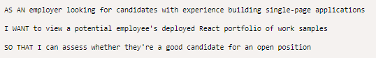
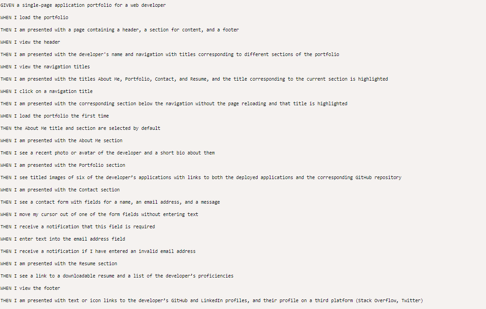
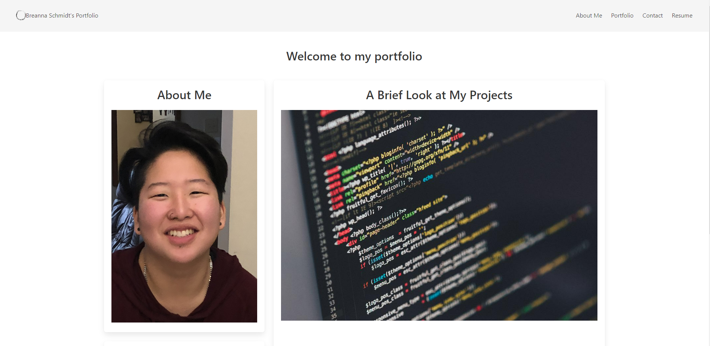

# React Portfolio
Be able to showcase developers ability and easy ways to contact them.
[See live site here](http://192.168.1.123:3000/)
# User Story

# Acceptance Criteria

# Screenshot

# Links 
GitHub:https://github.com/breschmidt182/reactPortfolio
Live: http://192.168.1.123:3000/
# Resources
- Front end img(resume pg): https://www.syncfusion.com/blogs/post/top-6-front-end-web-development-tools-to-increase-your-productivity-in-2020.aspx

- Back end img(resume pg): https://www.alamy.com/back-end-icon-simple-element-from-website-development-collection-filled-back-end-icon-for-templates-infographics-and-more-image385418430.html

- Database img(resume pg): https://www.ibm.com/blogs/think/es-es/2021/05/12/mejorando-la-infraestructura-de-ti-con-almacenamiento-ibm-hybrid-cloud-para-ibm-cloud-satellite/

- API img(resume pg): https://www.elemental.co.za/blog/web-development/development/what-are-apis-and-how-do-they-work

- Styling: https://bulma.io/